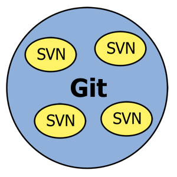

Si quieres usar Git y tus compañeros de equipo quieren usar SVN te mostraré un simple truco que uso con el que todos quedarán contentos. Si ya intentaste usar el comando git-svn que incluye Git para estos casos y no te fue del todo compatible con el repositorio SVN (como es mi caso) te recomiendo hacer lo siguiente.

La idea básicamente es “envolver” los repositorios SVN en un repositorio Git. Asi los cambios que se hagan en Git serán detectados por SVN y viceversa. Donde único hará falta nuestra intervención será en el momento que se agreguen nuevos ficheros ya que estos no estarían supervisados por el otro sistema de control de versiones y para solucionar automáticamente esto he creado un pequeño programa lo haga, se encuentra en:

[https://github.com/gllera/git-wrapper](https://github.com/gllera/git-wrapper)

Todavía no tiene todo lo que me gustaría ponerle pero cumple con su función básica que es la que comento aquí. Toda mejora que se le haga es bienvenida. El modelo que sigo para usar Git con SVN es tener en local una rama master en la que los repositorios SVN no deben detectar modificaciones a menos que vaya a hacer Commit a SVN y otra rama develop en la que hacer los desarrollos.