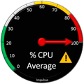

En este primer post quiero dar algunos detalles sobre mi blog ya que tengo pensado publicar cómo hago algunas cosas lo mejor posible después de estudiarlas detenidamente (a veces incluso hasta semanas) y así ayudar a otras personas que se encuentren en la misma situación y además para compartir la información :)

A modo resumen contaré sobre las tecnologías de mi blog:

Está hecho en WordPress utilizando una plantilla premium de Yootheme y está hospedado en Quijost. A modo de complementos utilizo FeedBurner para gestionar los feeds y Google Analytics para supervisar las visitas. Para optimizar mi sitio utilizo WP Super Cache y CloudFlare (incluido su plugin para WordPress). Para integrar Google Analytics con WordPress utilizo el plugin Google Analytics for WordPress. Desde mi móvil Android controlo remotamente mi blog con la aplicación WordPress y superviso las estadísticas de Google Analytics con mAnalytics. La licencia que uso para mis publicaciones la obtengo de Creativecommons.

Por qué uso todos esos productos en mi blog? Les comentaré cada uno.

CMS de WordPress

Para algunos quizás esté de más pero de todas formas les comentaré. Actualmente WordPress se ha convertido en un estándar en internet para los blogs y es ampliamente el CMS más usado. Yo la verdad hubiese preferido el núcleo de Joomla para mi blog porque tengo mucha más experiencia en él y porque se ajusta más a varios sitios que quiciese hacer pero es que WordPress supo llamar mi atención por su sencillez, su (casi) completo uso desde dispositivos móviles, su perfecta integración con todas las tegnologías vanguardias referentes a blogs y porque no necesito hacer casi nada para tener un blog como los que me gustan :) Claro que si hubiese utilizado Joomla también estuviesen leyendo mi blog ahora (porque también me hice varios blog en Joomla de pruebas) pero tanto desde mi punto de vista del sitio (administración, mantenimiento, actualización, etc) como el de ustedes (familiarización con los blogs comunes) no habría sido el mejor. Quizás haya alguna excepción pero WordPress parece ser induscutiblemente la mejor opción para tener un blog.

Plantillas premium de Yootheme

Yo soy de los que no se gastan el dinero tan fácilmente y pagar por software en mi mundo no es nada usual. La razón por la que utilizo plantillas de Yootheme en mi sitio es porque considero a esa compañía como una de las mejores en este tema y además porque quiero que mi sitio tenga características que casi ninguna plantillas gratis me ofrece (como una plantilla especial para móviles y una personalización excepcional) y que pueda actualizar mi blog con otra plantilla que me guste manteniendo todas las ventajas. Maquetar un sitio con sus plantillas es realmente muy fácil, ni siquiera necesitas saber programación, y una vez aprendes a trabajar con ellas puedes hacer sitios profesionales y personalizables sin mucho esfuerzo. También su costo es de los mejores del mercado. Estas incluso tienen su propio Framework que las dota muy bien y las mantiene actualizadas con atractivas mejoras. Actualmente llevo 1 año y 2 meses como miembro de Yootheme y siempre me he sentido satisfecho con ellos.

Hosting en Quijost

Quijost es una de las pocas empresas de hosting que tienen bien definido el concepto de “comienzo”. Ellos ofrecen planes de iniciación muy económicos con muy buenas características tanto para tener tu sitio ahí como para familiarizarse con los servidores hosting si estás todavía experimentando en este mundo. Comparado con otros proveedores, este prácticamente no tiene restricciones en los planes iniciales. Incluso trabajas con el cPanel que es tan popular en este mundo. Muchas compañías crean su propia versión del cPanel para ahorarse pagar su licencia pero eso, al menos para mi, normalmente significa perder funcionalidades y coger quebraderos de cabeza por no encontrar las cosas x(

FeedBurner

Esta interesante herramienta de Google para gestionar los Feeds quizás no sea muy conocida por ustedes porque siempre se ha mantenido “oculta” en los sitios webs. Yo la vi por primera vez en uso en el blog Fayerwayer y luego de analizarla detenidamente me pareció excelente. Con ella no solo balanceo el tráfico de mi sitio para hacerlo más estable y económico sino que también puedo tener una serie de estadísitcas muy detalladas acerca del impacto que mis Feeds han tenido en los lectores permitiéndome aprender de ellas y mejorar ;)

Google Analytics

Cuando de llevar estadísticas del tráfico del sitio se trata no creo que haya algo más detallado y completo que Google Analytics. Lo único que desearía de esta herramienta es que fuese 100% gratis (aunque dudo que a mí me llegue a costar porque es de pago solo cuando el sitio al que le mide el tráfico supera las 5.000.000 de páginas vistas mesuales xD)

Google Analytics for WordPress

De entre todas las herramientas para integrar Google Analytics y WordPress, esta parece ser la más popular aunque Google Analyticator puede ser que sea mejor (dependiendo de lo que ustedes necesiten) porque te integra algunas estadísitas de visitas de GA en tu mismo blog para consultarlas más fácilmente. Es una pena que no esté bien tenerlos los 2 activos porque se ejecuta el código para las estadísticas de visitas 2 veces dando un resultado erróneo.

WP Super Cache

Hoy en día es imprescindible para casi cualquier sitio web hacer uso de la caché para mejorar su rendimiento. Yo no lo creía necesario cuando se tenía el sitio hospedado en un buen servidor pero me he dado cuenta que no. Probando el rendimiento en una pc Core i7 2600K dedicada solamente a esto se pueden mostrar unas 13 páginas de WordPress por segundo haciendo trabajar a la CPU al 100%. Ahora, si instalamos este plugin y lo configuramos debidamente como se muestra en esta web podemos mostrar unas 2500 páginas por segundo, garantizando estabilidad al sitio hasta en los picos de visitas aunque el servidor tenga muy pocas prestaciones.

CloudFlare

Si necesitas optimizar un poco más tu sitio para que cargue más rápido, si tu proveedor de hosting se “cae” a cada rato o si tu web sufre ataques informáticos entonces CloudFlare te puede ayudar. En su versión gratis con tan solo unos clicks tienes tu web protegida, optimizada y con los datos estáticos replicados en otro servidor por si ocurriese una falla en el tuyo que no quede tu web inaccesible. Además te reduce el ancho de banda del sitio. Yo lo uso porque esta capa de seguridad al blog me brinda más confianza.

Aplicaciones para utilizar desde el móvil: WordPress y mAnalytics

Si tienes un móvil android estas dos aplicaciones me parecen imprescindibles para conocer en cualquier momento el estado actual de tu sitio e incluso hacer o eliminar publicaciones, moderar comentarios, etc. Es muy práctico y te facilita mucho la gestión del sitio en el momento que más dispuesto estés a hacerlo.

Creative Commons

Mediante Creative Commons puedo fácilmente licenciar el contenido de mi blog o de cualquier otro sitio que me pertenezca, ya sea por “formalismo” o por algún interés monetario. Así se le informa al usuario lo que puede y no puede hacer con el contenido sin tener que estar leyendo largos documentos de licencia porque lo que ve es tan simplificado que cualquiera lo comprendería al instante, aportando así incluso a que tengan más conciencia de sus actos. Claro que en mi caso es más bien por formalismo porque me gustaría que me diesen de referencia si utilizan mis publicaciones para algo xD

Así concluyo esta publicación, espero que les haya resultado interesante. A medida que vaya sacando el tiempo para escribir seguiré aportando más información sobre otros temas que igual me parecen muy buenos e iré actualizando los que ya he escrito en caso de que sea necesario.